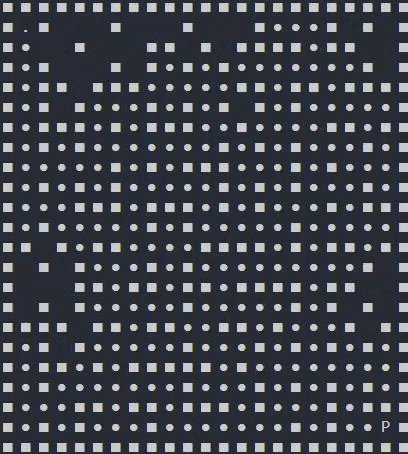

# mazesearch
##CP468 Assignment 1 Part 2; Finding optimal solutions to a maze input using DFS, BFS, Greedy BestFirst, A* algorithms.

Partners and Collaborators: 
https://github.com/arhanikram, https://github.com/linx5311, https://github.com/V1V3

